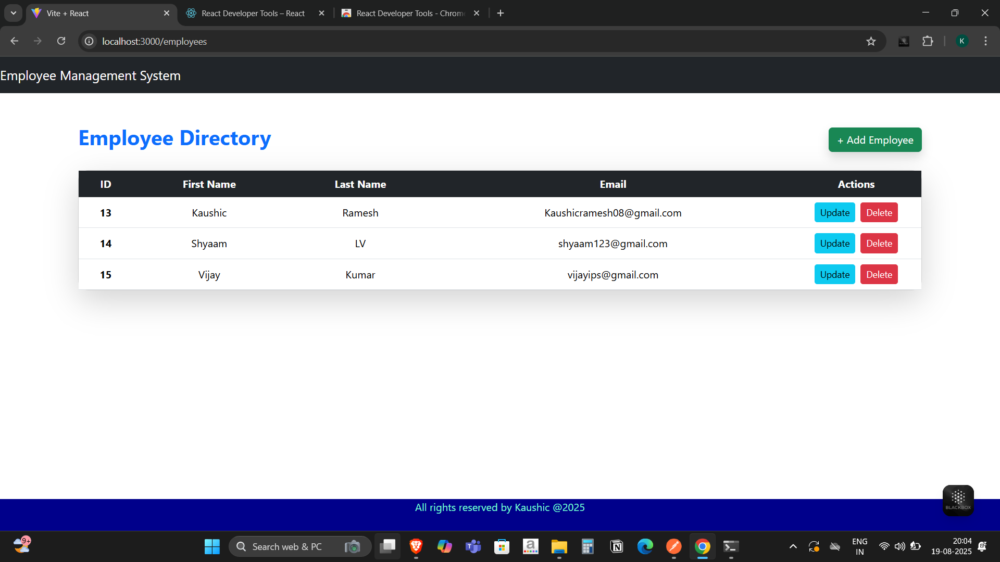
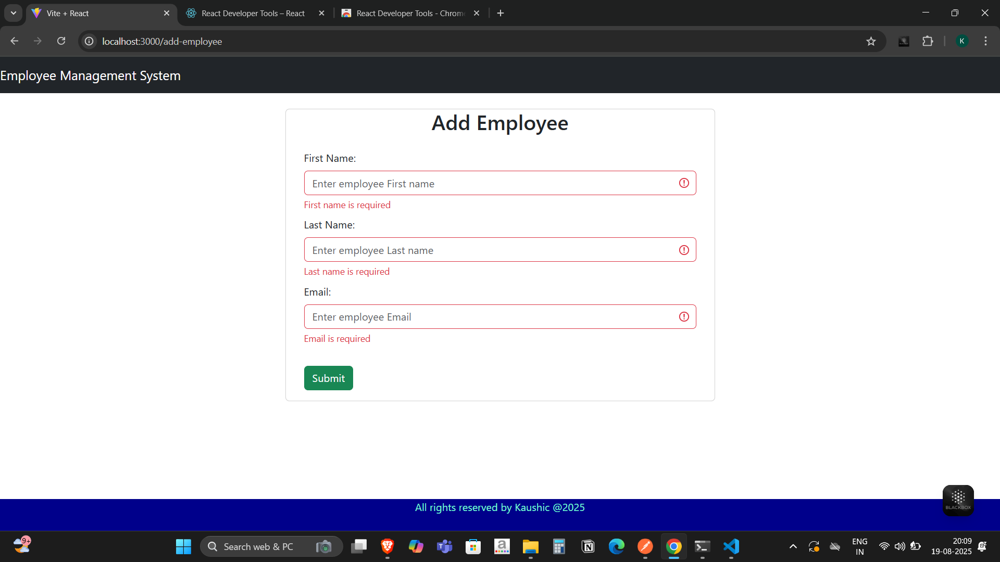

# Employee Management System


A full-stack **Employee Management System** built using **Spring Boot, Spring Data JPA, MySQL** for the backend and **React** for the frontend.  
This project allows users to perform CRUD operations (Create, Read, Update, Delete) on employee data with a simple and responsive UI.

---

## 📸 Screenshots

### Employee Directory


### Adding a New Employee


---

## ✨ Features
- Add a new employee
- Update employee details
- Delete an employee
- View all employees in a table
- Responsive UI built with React
- REST APIs built with Spring Boot & Spring Data JPA
- Data stored in MySQL database

---

## 🛠️ Tech Stack

### Backend
- **Spring Boot** (REST API)
- **Spring Data JPA** (ORM)
- **MySQL** (Database)

### Frontend
- **React** (UI)
- **Axios** (API calls)
- **Bootstrap / CSS** (Styling)

---

## ⚙️ Installation & Setup

### 1. Clone the repository
```bash
git clone https://github.com/your-username/employee-management.git
cd employee-management
